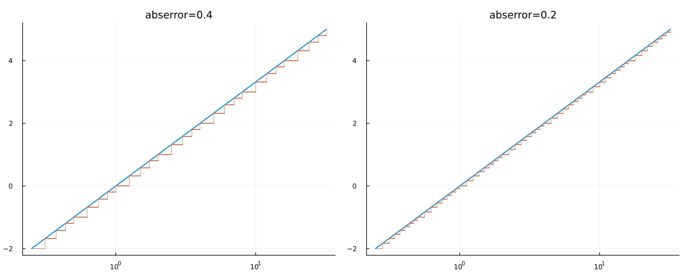

# ApproxLogFunction

A lookup table based method to calculate $y = {\rm log}_b(x)$ with a controllable error, where $b > 1$, $x > 0$, and $x$ shall be the **IEEE754** floating-point **normal** numbers.

## 💽 Installation

```julia
julia> import Pkg;
julia> Pkg.add("ApproxLogFunction");
```

## 👨‍🏫 Usage

### 🔌 Exposed Functor

The exposed constructor :

```julia
Approxlog(base::Real; abserror::Real, dtype::Type{<:AbstractFloat})
```

where  `base`  is the radix of logarithm operation,  `abserror`  is the maximum absolute error of the `output` and  `dtype`  is the data type of input and output value, for example :

```julia
alog₂  = Approxlog(2, abserror=0.1, dtype=Float32);
input  = 5.20f2;
output = alog₂(input);
```

### 📈 Error Visualization

```julia
using Plots, ApproxLogFunction

figs = []
base = 2
t  = -2f-0 : 1f-4 : 5f0;
x  = 2 .^ t;
y₁ = log.(base, x)
for Δout in [0.4, 0.2]
    alog = Approxlog(base, abserror=Δout, dtype=Float32)
    y₂ = alog.(x)
    fg = plot(x, y₁, linewidth=0.8, xscale=:log10);
    plot!(x, y₂, linewidth=0.7, titlefontsize=12)
    title!("abserror=$Δout")
    push!(figs, fg)
end
plot(figs..., layout=(1,2), leg=nothing, size=(999,666))
```



## 🥇 Benchmark

### 💃🏻 Scalar Input

```julia
julia> using ApproxLogFunction, BenchmarkTools;
julia> begin
           type = Float32;
           base = type(2.0);
           Δout = 0.1;
           alog = Approxlog(base, abserror=Δout, dtype=type);
       end;
julia> x = 1.23456f0;
julia> @benchmark y₁ = log($base, $x)
BenchmarkTools.Trial: 10000 samples with 998 evaluations.
 Range (min … max):  20.040 ns … 86.573 ns  ┊ GC (min … max): 0.00% … 0.00%
 Time  (median):     21.643 ns              ┊ GC (median):    0.00%  
 Time  (mean ± σ):   22.212 ns ±  2.884 ns  ┊ GC (mean ± σ):  0.00% ± 0.00%
 Memory estimate: 0 bytes, allocs estimate: 0.

julia> @benchmark y₁ = log2($x)
BenchmarkTools.Trial: 10000 samples with 1000 evaluations.
 Range (min … max):  10.900 ns … 38.800 ns  ┊ GC (min … max): 0.00% … 0.00%
 Time  (median):     14.800 ns              ┊ GC (median):    0.00%  
 Time  (mean ± σ):   15.213 ns ±  1.922 ns  ┊ GC (mean ± σ):  0.00% ± 0.00%
 Memory estimate: 0 bytes, allocs estimate: 0.

julia> @benchmark y₂ = alog($x)
BenchmarkTools.Trial: 10000 samples with 976 evaluations.
 Range (min … max):  70.697 ns …  2.731 μs  ┊ GC (min … max): 0.00% … 96.03%
 Time  (median):     74.129 ns              ┊ GC (median):    0.00%
 Time  (mean ± σ):   80.076 ns ± 59.266 ns  ┊ GC (mean ± σ):  1.61% ±  2.14%
 Memory estimate: 32 bytes, allocs estimate: 2.
```

### 👨‍👨‍👧‍👧 Array Input

```julia
julia> using ApproxLogFunction, BenchmarkTools;
julia> begin
           type = Float32;
           base = type(2.0);
           Δout = 0.1;
           alog = Approxlog(base, abserror=Δout, dtype=type);
       end;
julia> x = rand(type, 1024, 1024);
julia> @benchmark y₁ = log.($base, $x)
BenchmarkTools.Trial: 228 samples with 1 evaluation.
 Range (min … max):  20.717 ms … 28.521 ms  ┊ GC (min … max): 0.00% … 23.03%
 Time  (median):     21.422 ms              ┊ GC (median):    0.00%
 Time  (mean ± σ):   21.930 ms ±  1.687 ms  ┊ GC (mean ± σ):  1.84% ±  5.51%
 Memory estimate: 4.00 MiB, allocs estimate: 2.

julia> @benchmark y₁ = log2.($x)
BenchmarkTools.Trial: 407 samples with 1 evaluation.
 Range (min … max):  11.248 ms … 23.749 ms  ┊ GC (min … max): 0.00% … 38.98%
 Time  (median):     11.626 ms              ┊ GC (median):    0.00%
 Time  (mean ± σ):   12.266 ms ±  1.806 ms  ┊ GC (mean ± σ):  3.55% ±  8.84%
 Memory estimate: 4.00 MiB, allocs estimate: 2.

julia> @benchmark y₂ = alog.($x)
BenchmarkTools.Trial: 876 samples with 1 evaluation.
 Range (min … max):  4.849 ms … 18.183 ms  ┊ GC (min … max): 0.00% … 54.80%
 Time  (median):     5.207 ms              ┊ GC (median):    0.00%
 Time  (mean ± σ):   5.681 ms ±  1.679 ms  ┊ GC (mean ± σ):  7.58% ± 13.72%
 Memory estimate: 4.00 MiB, allocs estimate: 7.
```

Calculating scaler input is slower, but why calculating array input is faster ? 😂😂😂

## ⚠️ Attention

Error is well controlled when using IEEE754 floating-point positive **normal** numbers, which is represented as :

$$
x = 2^{E-B} \ (1 + F * 2^{-FW})
$$

where $E$ is the value of exponent part, $B=(2 ^ {EW - 1} - 1)$ is the bias for $E$, $EW$ is the bit width of $E$, $F$ is the value of fractional part, and $FW$ is the bit width of $F$.  So the range for an `Approxlog` object's input is $[X_{\rm min}, X_{\rm max}]$, where

$$
\begin{aligned}
X_{\rm min} &= 2^{1-B} \ (1 + 0 * 2^{-FW}) \\
X_{\rm max} &= 2^{(2^{EW}-2)-B} \ (1 + (2^{FW}-1) * 2^{-FW})
\end{aligned}
$$

In short, for `Float16`  input, its range is :

$$
2^{1-15} \ (1 + 0 * 2^{-10}) \le
X_{\rm Float16} \le 2^{30-15} \ (1 + (2^{10} -1) * 2^{-10})
$$

for `Float32` input :

$$
2^{1-127} \ (1 + 0 * 2^{-23}) \le
X_{\rm Float32} \le 2^{254-127} \ (1 + (2^{23} -1) * 2^{-23})
$$

and for `Float64` input :

$$
2^{1-1023} \ (1 + 0 * 2^{-23}) \le
X_{\rm Float64} \le 2^{2046-1023} \ (1 + (2^{52} -1) * 2^{-52})
$$

As to positive **subnormal** numbers, the result is not reliable.

## 📁 C-Lang Files

Interface function :

```julia
toclang(dir::String, filename::String, funcname::String, f::Approxlog)
```

`dir`  is the directory to save the C language files (`dir`  would be made if it doesn't exist before),   `filename` is the name of the generated `.c` and `.h` files, `funcname` is the name of the generated approximate function and `f`  is the approximate log functor, for example :

```julia
alog₂ = Approxlog(2, abserror=0.12, dtype=Float32)
toclang("./cfolder/",  "approxlog", "alog", alog₂)
```

this would generate  `approxlog.c`  and  `approxlog.h`  files in `./cfolder/`, the function is named as `alog` .
